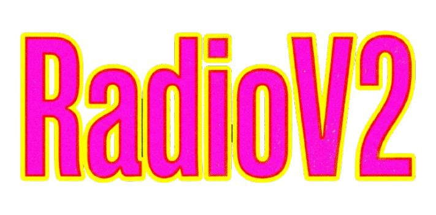
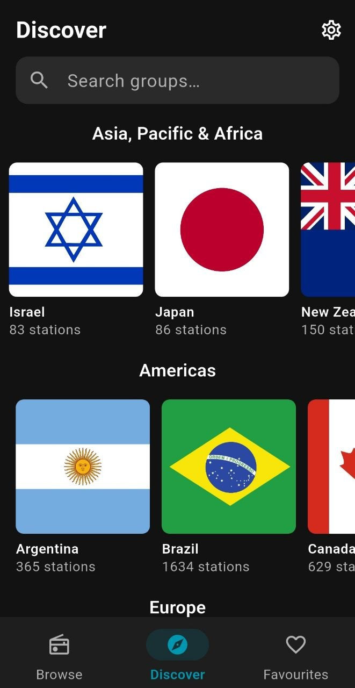
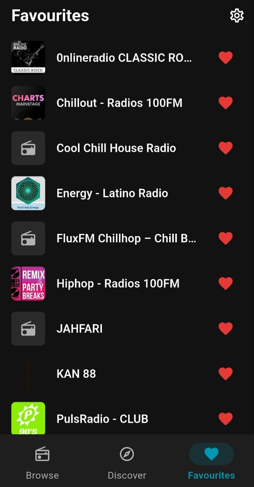
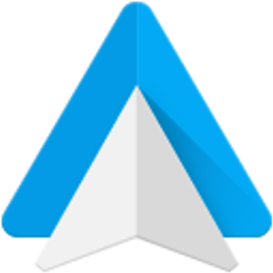

<p align="center">
  
</p>

<p align="center">
  <a href="https://github.com/Natboa/RadioV2-Android/releases"></a>
  <a href="https://github.com/Natboa/RadioV2-Android/releases"></a>
  <a href="https://github.com/Natboa/RadioV2-Android/releases"></a>
  
  <a href="LICENSE"></a>
</p>

<h3 align="center">A modern Android internet radio player with a clean dark UI.</h3>

<p align="center">
  
</p>

<table align="center">
  <tr>
    <td></td>
    <td></td>
    <td></td>
    <td></td>
  </tr>
</table>

<p align="center">
  
  &nbsp;&nbsp;
  <strong>Supports Android Auto</strong>
</p>

<p align="center">
  
  <br/>
  <strong>Supports Android TV</strong>
</p>

## Overview

RadioV2 Android is the mobile companion to the RadioV2 desktop app. It lets you discover, browse, and stream tens of thousands of internet radio stations organized by genre and country, with full background playback and lock-screen controls.

## Features

- Browse stations with live search and persistent recently visited history
- Discover stations by category with horizontal genre rows
- Search stations within any genre group
- Save and manage favourite stations (persisted across restarts and updates)
- Mini player bar always visible across all screens
- Background playback — music keeps playing when the app is minimized or the screen is off
- Media notification with artwork, play/pause, next, and previous controls
- Lock screen controls
- Animated equalizer bars on the currently playing station
- Android Auto support — browse favourites and control playback from your car
- Android TV support — full D-pad navigable TV interface with side rail, discover, browse, and favourites
- Dark theme

## Installation

Two separate APKs are available — one for phones and one for Android TV. Download the right one for your device from the [latest release](https://github.com/Natboa/RadioV2-Android/releases).

**Phone (Android 8.0+)**

👉 [RadioV2.apk](https://github.com/Natboa/RadioV2-Android/releases)

**Android TV**

👉 [RadioV2-TV.apk](https://github.com/Natboa/RadioV2-Android/releases)

> Enable *Install from unknown sources* in your device settings if prompted.


## Tech Stack

| Layer | Technology |
|---|---|
| UI Framework | Flutter 3.22+ / Dart 3.4+ |
| State Management | Riverpod 2.5 + riverpod_annotation (code-gen) |
| Audio Playback | just_audio + audio_service |
| Database | Drift 2.18 (SQLite) — bundled station database |
| Navigation | go_router with indexed tab stack |
| Image Caching | cached_network_image + flutter_cache_manager |
| Persistence | SharedPreferences (history) + SQLite FavouriteTable |
| Target Platform | Android 8.0+ (API 26+) |

## Project Structure

```
lib/
├── core/
│   ├── audio/              # RadioAudioHandler (wraps just_audio + audio_service)
│   ├── data/
│   │   ├── datasource/     # DatabaseInitializer — copies bundled DB on first launch
│   │   └── repository/     # StationRepository, FavouriteRepository (interface + impl)
│   ├── database/           # Drift AppDatabase, DAOs, table definitions
│   ├── designsystem/       # Colors, theme
│   ├── model/              # Station, Group, Category
│   ├── ui/widgets/         # StationListItem, GroupCard, SoundBars, MiniPlayer
│   ├── providers.dart      # Core Riverpod providers
│   └── recently_visited_notifier.dart
├── feature/
│   ├── browse/             # Browse screen — search + recently visited
│   ├── discover/           # Discover screen — categories, groups, group detail
│   ├── favourites/         # Favourites screen
│   └── player/             # PlayerNotifier, PlayerState, NowPlaying screen
├── navigation/             # go_router route definitions
└── main.dart               # Bootstrap: AudioService + SharedPreferences + ProviderScope
```

## Legal

RadioV2 Android is an internet radio aggregator and does not host or rebroadcast audio content. All streams are provided by third-party radio stations and accessed directly by users.

## License

Distributed under the MIT License. See [LICENSE](LICENSE) for details.
